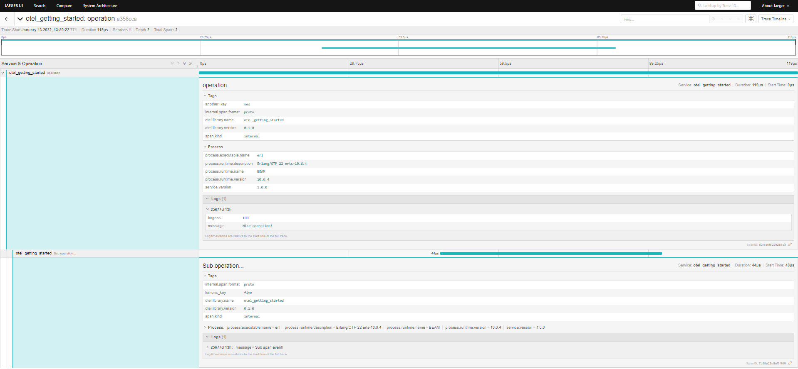

# OpenTelemetry Erlang trace exporter example

## Steps to run the sample:
1. Start the otel-collector and Jaeger using [docker compose](https://docs.docker.com/compose/install/).
```shell
docker-compose up
```   

Once the they are running, Jaeger UI should be accessible at: http://localhost:16686/

2. Start the Erlang app:

``` shell
rebar3 shell
```

You will get some startup messages in your console like the following:
```shell
===> Verifying dependencies...
===> Analyzing applications...
===> Compiling otel_getting_started
Erlang/OTP 22 [erts-10.6.4] [source] [64-bit] [smp:4:4] [ds:4:4:10] [async-threads:1]

Eshell V10.6.4  (abort with ^G)
1> ===> Booted hpack
===> Booted chatterbox
===> Booted acceptor_pool
===> Booted gproc
===> Booted ctx
===> Booted grpcbox
===> Booted ssl_verify_fun
===> Booted tls_certificate_check
===> Booted opentelemetry_api
===> Booted opentelemetry
===> Booted opentelemetry_exporter
===> Booted otel_getting_started
===> Booted sasl
```

And whenever everything is booted and loaded properly, you can call the hello function:
```shell
otel_getting_started:hello().
```
Which should return `true`.

3. Vizualise the traces:
In the Jaeger UI, for every call you will get a single trace with 2 spans like this one:

